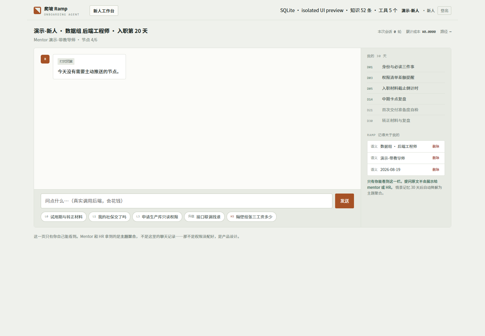
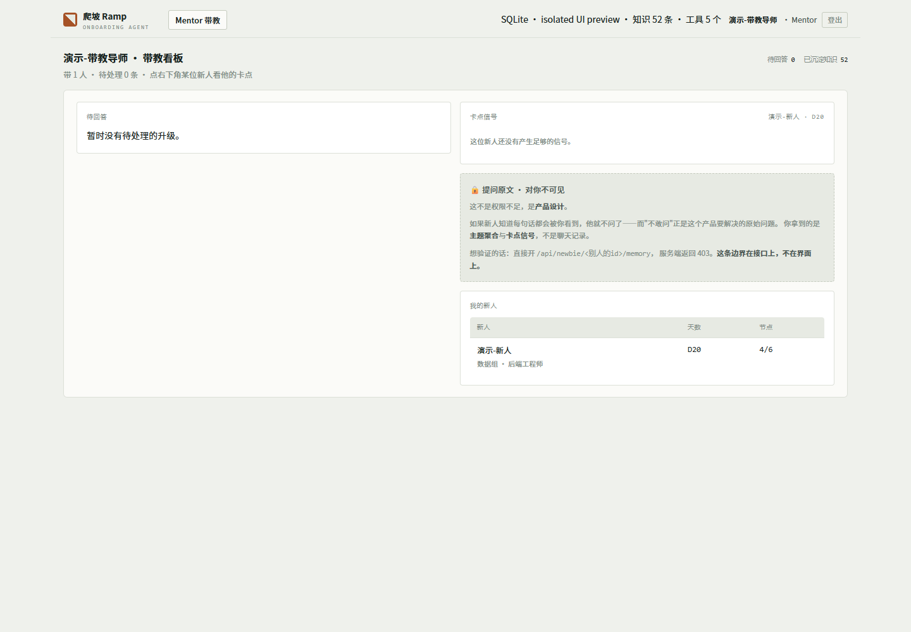
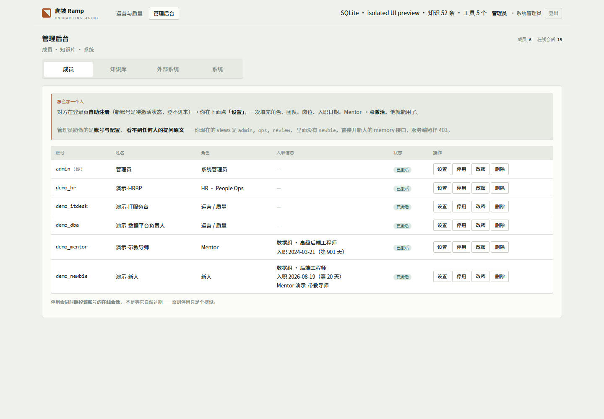
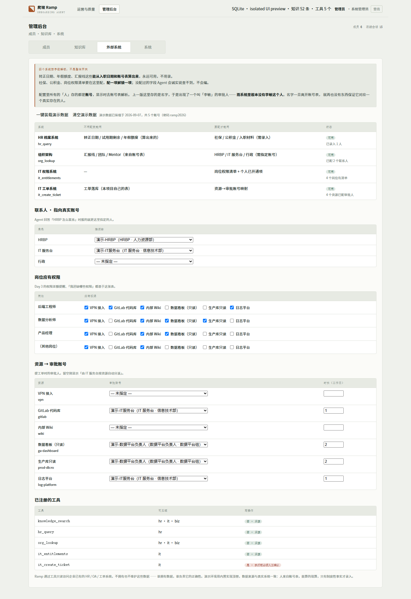
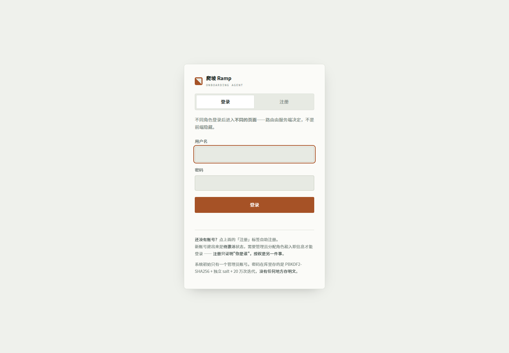
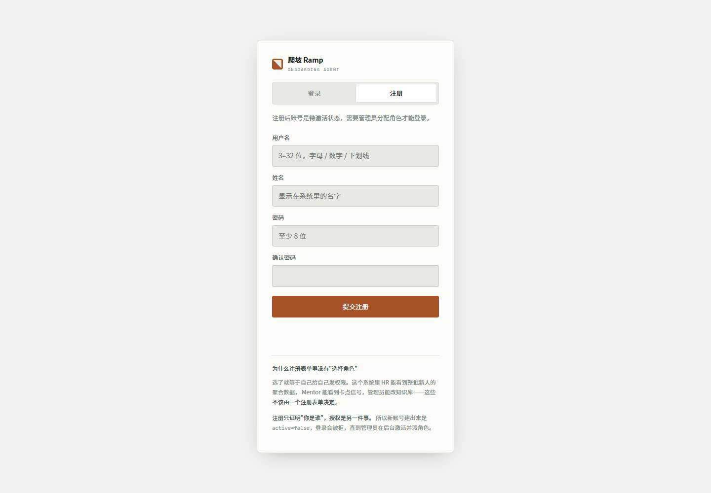
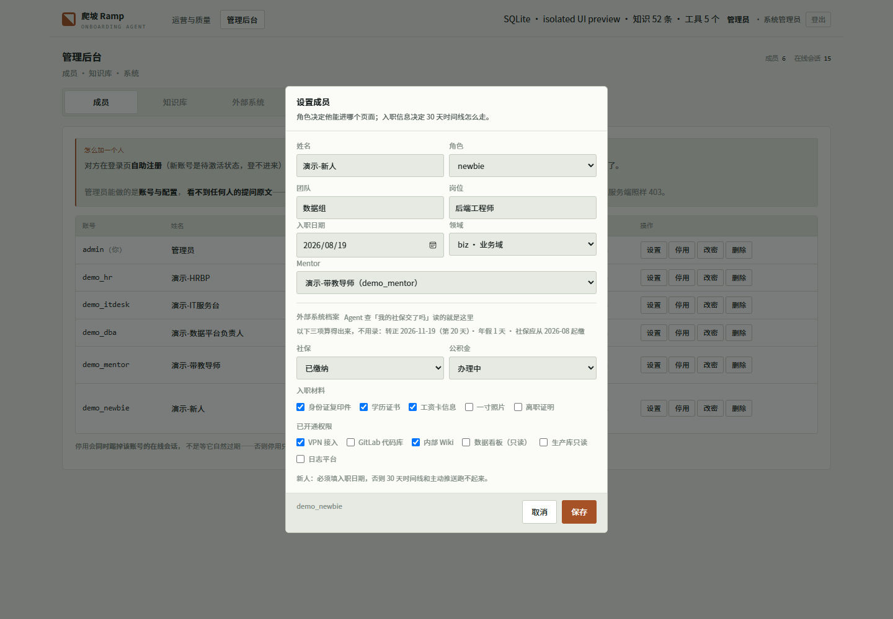
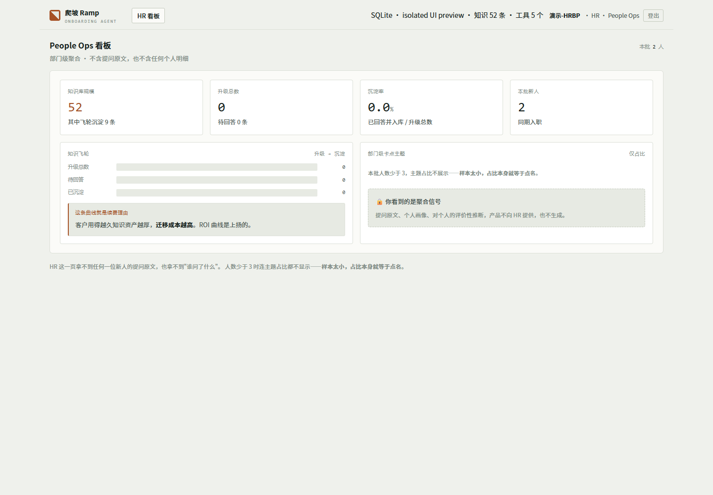
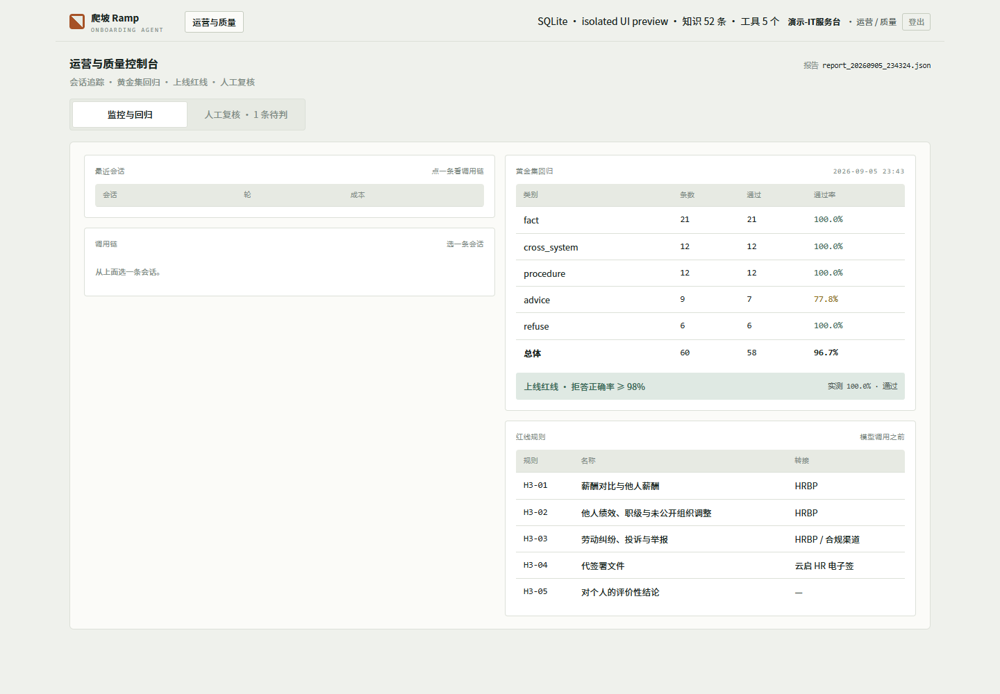
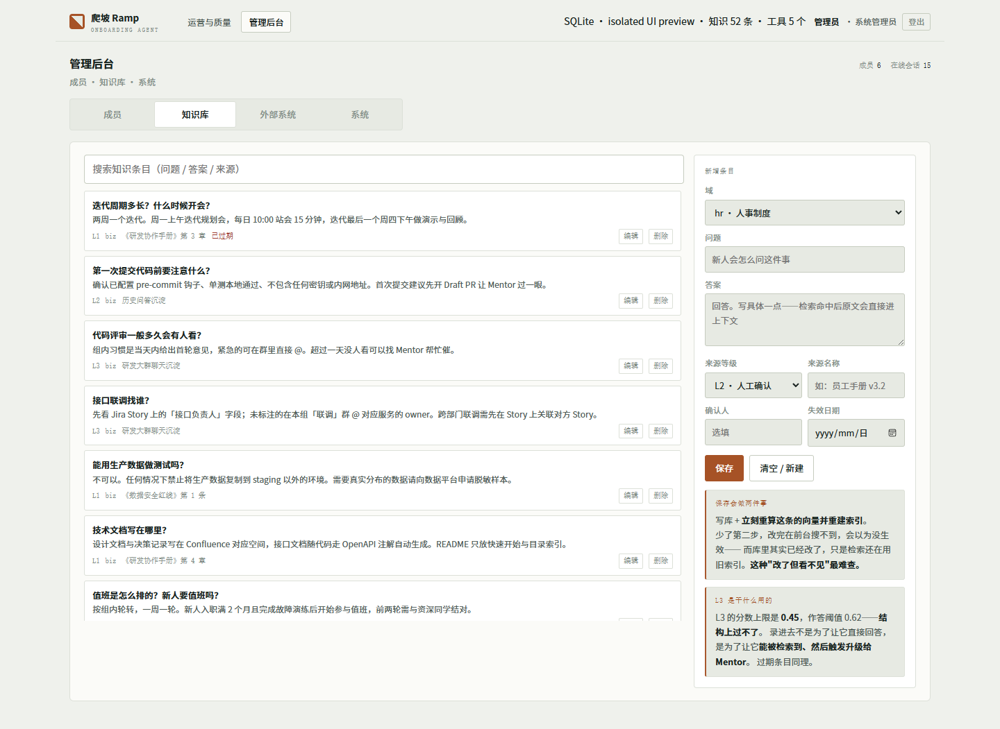

# 爬坡 Ramp

企业新人入职 30 天带教 Agent，帮助新人查询制度、了解个人入职事项、提交权限申请，并将知识库未覆盖的问题交给 Mentor。Mentor 的回答可沉淀为知识，供后续新人复用。

个人作品集项目，包含后端、五种角色的前端、内置业务系统演示、评测集与部署配置。尚未进行真实企业效果验证。

## 核心功能

- 按意图处理：知识检索作答、个人数据查询、经验建议、升级 Mentor、敏感请求拦截。
- LangGraph 编排 HR、IT、业务域子图，按领域限制工具范围。
- 权限申请先展示确认卡片，确认后工单落库；当前不包含批准/驳回流程。
- 30 天带教时间线、入职节点提醒、记忆与角色可见性控制。
- 知识来源分级、时效降权、混合检索与语义下限，支持 Mentor 回答沉淀。
- 后台维护成员、入职日期、Mentor、知识库、业务状态、联系人与岗位权限。

## 最新界面截图

以下截图由当前页面和后端在**独立本地演示环境**中生成（2026-09-07）。账号与业务状态来自项目演示装载器，不是实际员工数据。截图环境使用临时 SQLite 和本地 hashing 向量，不调用付费模型，不代表线上问答评测；正常部署使用 MySQL/MariaDB。

### 新人工作台



### Mentor 带教台



### 管理后台：成员



### 管理后台：外部系统配置



<details>
<summary>登录、注册、成员设置、HR、运营及知识库截图</summary>








</details>

## 架构与数据边界

```text
新人提问 → 前置红线检查 → 意图分类 → HR / IT / 业务域子图
                                   ├─ 检索 → 作答 / 建议 / 升级 Mentor
                                   └─ 工具调用 → 只读返回 / 写入前暂停确认
Mentor 回答 → 可选沉淀知识库 → 后续检索复用
```

技术栈：Python、FastAPI、LangGraph、SQLAlchemy、MySQL（部署采用 MariaDB 11.4）、DeepSeek、DashScope Embedding、BM25。LangSmith 为可选追踪集成，需要自行配置。

四个业务系统由 `ramp/external.py` 提供适配层：

| 模式 | 当前能力 |
|---|---|
| builtin（默认） | 内置 HR 状态、组织联系人、权限清单、工单持久化；缺数据时明确说明 |
| off | 不接入业务系统，保留诚实降级路径 |
| live | 预留模式，真实企业 API 尚未实现 |

联系人、Mentor 与审批人引用账号；演示人员是可登录账号。知识库为虚构制度，演示社保、公积金状态不代表实际缴纳。日期、年假等推算依赖演示规则，不作为真实人事结论。工单提交不等于审批完成，撤回和审批结果主动通知也未形成完整流程。

## 本地运行

需要 Python 3.11+、uv、可连接的 MySQL/MariaDB。先创建本地配置：

```bash
cp .env.example .env
uv sync --frozen
```

在 `.env` 中填写数据库连接、`DEEPSEEK_API_KEY`；使用真实向量检索时填写 `DASHSCOPE_API_KEY` 并设置 `RAMP_EMBEDDING_BACKEND=dashscope`。hashing 可用于界面测试，但检索质量不能与真实向量评测比较。

```bash
uv run python -m ramp.bootstrap
uv run uvicorn ramp.api:app --host 127.0.0.1 --port 8000
```

打开 [本地登录页](http://127.0.0.1:8000/login)。初始化只创建管理员，默认 `admin / ramp2026`，可通过 `ADMIN_USERNAME`、`ADMIN_PASSWORD` 配置。共享部署请修改默认密码。

管理员进入「外部系统」→「一键装载演示数据」，才会创建以下账号，演示密码均为 `ramp2026`：

| 账号 | 角色 |
|---|---|
| demo_newbie | 新人 |
| demo_mentor | Mentor |
| demo_hr | HR |
| demo_itdesk、demo_dba | 运营角色的演示服务台/负责人 |

也可自行注册，由管理员激活并设置入职信息。建议体验「我的 Mentor 是谁」「我的社保交了吗」「我还缺哪些权限」。

Docker 配置位于 `deploy/`。需先填写对应环境变量并初始化数据库；容器启动命令本身不代替建表。

## 评测与局限

黄金集为作者依据虚构知识库构造的 60 道题，不能视为真实用户研究。最近留存的全量报告为 **2026-09-05 23:43：58/60**：事实 21/21、跨系统 12/12、流程 12/12、建议 7/9、拒答 6/6，报告费用约 ¥0.2187，耗时 488.4 秒，业务系统模式固定为 off。本次交付没有重新运行付费模型评测。

历史存在 60/60 的运行，但不代表每次均能达到。6 道拒答题通过不能证明线上拒答率已达到 98%；规则与检索门槛降低风险，不能保证所有绕过方式或错误回答均被拦截。模型回答与模型判分都可能波动，同路由、同工具不足以证明质量完全一致。

历史 ¥0.5835 → ¥0.1709 是**整套 60 题的记录费用**，不是单次会话费用；配置、缓存等差异影响成本，不能直接作为严格对照实验的降本结论。

```bash
uv run python scripts/check_web.py
uv run python -m ramp.eval.run
```

完整评测会调用模型并产生费用。`scripts/check_external.py` 会装载/清理演示数据，只应在独立测试数据库运行。

## 目录与交付范围

```text
ramp/       后端、Agent 图、工具、记忆、评测及角色页面
seed/       虚构知识库、演示规则、公开语料主题编码素材
scripts/    检查与辅助脚本
deploy/     Docker 配置
docs/       成本说明及界面截图
```

公开语料目录为探索材料：140 条搜索摘要中有 46 条候选用户来源，原记录标记为未人工核对，不能据此声称已完成有效用户访谈。

交付包仅包含本仓库源码和文档，不含 .env、访问密钥、数据库、聊天记录、虚拟环境或其他项目。最新截图见 `docs/screenshots/latest/`，上级截图目录保留历史版本。
