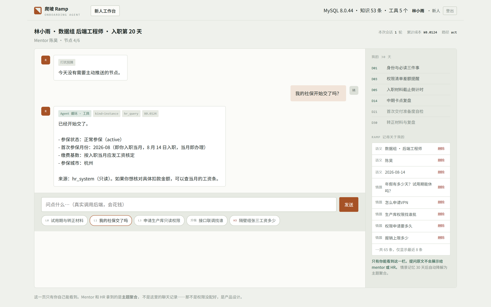
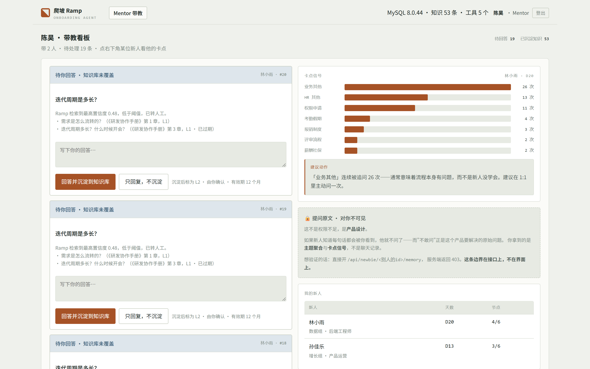
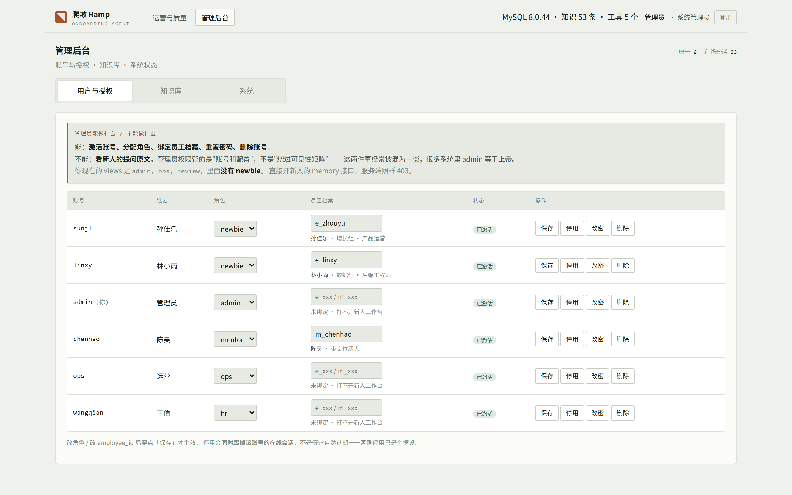
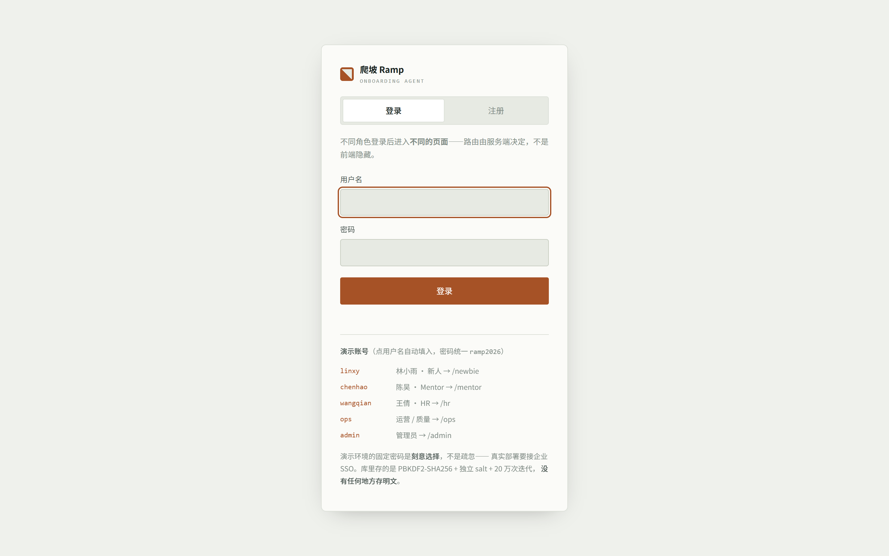

# 爬坡 Ramp

> 新人入职 30 天带教 Agent —— 面向企业 People Ops 的 B 端 Agent 产品

不是"公司制度问答机器人"。它是一条**有状态的 30 天时间线**：知道今天是新人的第几天、
他卡在哪、什么该主动推给他、什么必须留给人来回答。

技术上是一个 **LangGraph 编排 + MySQL 持久化**的 Agent 系统，
但每一处技术选择背后都对应一个产品决策——这份 README 主要讲后者。

| | |
|---|---|
| **黄金集通过率** | 60 / 60 · 拒答正确率 100%（上线红线 ≥98%） |
| **角色** | 新人 / Mentor / HR / 运营 / 管理员，五套独立界面 |
| **规模** | 7800 行 · 23 模块 · 34 个接口逐条验证权限 |
| **周期** | 六周，独立完成 |

---

## 长什么样

**新人工作台**——提问后走工具调用查到本人真实数据。徽章标出走了哪条路径、
调了哪个工具、这一轮花了多少钱；右栏是 30 天时间线与「Ramp 记得关于我的」，
每条记忆本人可随时删除。



**Mentor 带教台**——知识库没覆盖的问题会升级到这里，回答后一键沉淀为知识条目。
右下角那块「🔒 提问原文 · 对你不可见」不是权限没配好，是产品设计。



**管理后台**——账号与授权、知识库增删改、系统状态。管理员能派角色、
能改知识库，但**看不到新人的提问原文**。



<details>
<summary>登录与注册</summary>

注册后是待激活状态，由管理员分配角色——**注册只证明"你是谁"，授权是另一件事**。



</details>

---

## 运行时主流程

```
                            用户提问
                               │
                      ┌────────▼────────┐
                      │  红线检查 · H3   │  ← 图外前置拦截
                      └────────┬────────┘     命中即终止，¥0.00，不调模型
                    命中 │           │ 未命中
        ┌────────────────┘           │
        ▼                            ▼
  拒答 · 转人工              ┌─────────────────┐
  不写记忆                   │  意图分类 tier2  │
                            └────────┬────────┘
                                     ▼
                            ┌─────────────────┐
                            │ 域分派 Supervisor│  工具集与知识范围随之收窄
                            └────────┬────────┘
        ╔════════════════════════════▼════════════════════════════╗
        ║  域子图 subgraph      [HR 域]  [IT 域]  [业务域]         ║
        ║                                                          ║
        ║   单步检索 58% ──┐              ┌── 需动作/多步 42%      ║
        ║                  ▼              ▼                        ║
        ║          知识检索 RAG      Agent 循环                    ║
        ║                  │              │                        ║
        ║         置信度≥0.62?      需写入外部系统?                ║
        ║          是 │   │ 否        否 │   │ 是                  ║
        ║             ▼   ▼             ▼   ▼                      ║
        ║        作答  生成升级卡片  直接执行  人工确认 H2          ║
        ║               │                        │ interrupt()     ║
        ║               ▼                        ▼                 ║
        ║        Mentor 一键回答          执行 + checkpoint 挂起   ║
        ╚═══════════════╪══════════════════════════════════════════╝
                        ▼
                 沉淀为 L2 知识 ──写回──► 知识库 ──读取──► 检索层
                                        （知识飞轮）

  每条路径写入 Trace：耗时 · 档位 · token · 缓存命中 · 成本
  除红线路径外写入三层记忆（情景 / 语义 / 程序）
```

完整图见 `../diagram/ramp-runtime-flow/`。

---

## 五分钟跑起来

```bash
cd ramp
cp .env.example .env      # 填 MYSQL_PASSWORD 与 DEEPSEEK_API_KEY
uv sync
uv run python -m ramp.bootstrap        # 建库建表 + 灌 52 条知识
uv run python -c "from ramp import runtime; print(runtime.ask('试用期多久？')['answer'])"
```

跑评测：

```bash
uv run python -m ramp.eval.run              # 全量 60 条
uv run python -m ramp.eval.run --only refuse # 只跑上线红线那 6 条
```

起服务（含前端）：

```bash
uv run python -m ramp.api    # http://127.0.0.1:8000
```

打开 `http://127.0.0.1:8000`，会**按角色自动跳到对应页面**。演示账号密码统一 `ramp2026`：

| 账号 | 身份 | 落地页 |
|---|---|---|
| `linxy` | 林小雨 · 新人 | `/newbie` |
| `chenhao` | 陈昊 · Mentor | `/mentor` |
| `wangqian` | 王倩 · HR | `/hr` |
| `ops` | 运营 / 质量 | `/ops` |
| `admin` | 系统管理员 | `/admin` |

登录页另有**注册**入口：注册出来的账号是 `active=false`，登不进去，
要管理员在 `/admin` 激活并分配角色。

改完前端跑一下自检：

```bash
uv run python scripts/check_web.py
```

---

## 十个产品决策，落在代码的哪一行

### 1. 红线拦在图外，不在图内

`runtime.ask()` 先跑 `guardrails.check()`，命中直接返回，**一次模型调用都没有**。

为什么不让模型自己判断：**成本**（命中红线的请求 ¥0.00）、**不可绕过**（模型的自我约束能被 prompt 注入撬开，前置规则不能）、**可审计**（每次拦截能指到具体规则 ID）。

代价是召回不完美——换了说法的越界提问会漏。所以这是**下限而非上限**，漏网的由系统提示词兜第二道。

→ `guardrails.py` · `runtime.py:ask()`

### 2. 来源分级与保鲜是**乘性上限**，不是加分项

```python
score = (α·cosine + (1-α)·bm25) × SOURCE_LEVEL_CAP[level] × stale_penalty
```

`SOURCE_LEVEL_CAP["L3"] = 0.45`，而作答阈值是 0.62。所以**一条 L3 口述知识无论文本多匹配，都不可能单独作答**——由结构保证，不是靠 prompt 里写一句"请谨慎"。

实测：`接口联调找谁` 语义相似度 0.90（近乎完美命中），最终分 0.427 → 转人工。
`IT服务台多久响应` 相似度 0.89，但文档过期 → 0.472 → 转人工。

→ `knowledge.py:search()` · `config.SOURCE_LEVEL_CAP`

### 3. 知识飞轮：唯一把输出变回输入的一条边

未命中 → 升级卡片 → Mentor 一键回答 → 审核沉淀为 L2 → 下一位新人直接命中。

实测同一个问题（`接口联调应该找谁？`）：

```
沉淀前  best=0.427   低于阈值 0.62  → 转人工
           ↓  Mentor 陈昊 回答 → 沉淀为知识 #53
沉淀后  best=0.806   高于阈值      → 直接作答     (+0.379)
```

命中的条目是 `[L2] 历史问答沉淀 · 由 陈昊 确认 · 生效 2026-08-27`——来源可溯、有效期在册。

注意它停在 **0.806** 而不是更高：L2 的乘性上限是 0.85，
**沉淀知识永远压在权威文档之下**。Mentor 的一句话不能盖过制度文件，
这是设计不是巧合。

`sink=False` 时只回复不沉淀——**不是所有回答都值得成为组织资产**，
这个开关本身是产品决策。

→ `escalate.py:answer_and_sink()` · `knowledge.py:reload_index()`

### 4. 提问原文对 Mentor 和 HR 都不可见

| 数据 | 新人本人 | Mentor | HR |
|---|---|---|---|
| 提问原文 | ✅ 可见可删 | ❌ | ❌ |
| 主题聚合 | ✅ | ✅ 绝对次数 | ✅ **仅占比** |
| 掉队信号 | ❌ 不推送 | ✅ 推送 | ❌ |
| 对个人的评价 | — | — | **产品不生成** |

因为如果新人知道每句话都会被 leader 看到，他就不问了——而"不敢问"正是这个产品要解决的原始问题。**产品会死于信任崩塌，不是死于功能不足。**

掉队信号只推给 mentor 不推给新人本人：直接说"你落后了"产生的不是紧迫感，是被监视感。

→ `memory.py:for_viewer()` —— 所有角色读记忆的**唯一入口**，不允许绕过

### 4b. 五个角色五个页面，不是一页藏标签

第一版前端是**一个 `index.html` 装五个视角**，登录后按角色把用不到的
标签隐藏掉。看着能跑，但它把上一条决策架空了：

- 没登录时**整个骨架都能看到**——新人不该知道管理后台长什么样；
- 五个视角共用一份 JS，谁在调谁的接口没人看得出来。

拆成一页一个角色之后，两处**一直存在但被掩盖的越权**当场暴露：

| 页面 | 它在调 | 该调 |
|---|---|---|
| 新人页 | `/mentor/{id}/mentees`（挑出自己那条） | `/newbie/{id}/profile` |
| Mentor 页 | `/hr/dashboard`（只为取知识库总数） | `/mentor/kb-count` |

加了鉴权之后这两条直接 403。**它们不是拆页拆出来的新 bug，
是拆页把旧 bug 照出来了**——单页时代所有 fetch 挤在一个文件里，
互相抄还能抄对，也就没人发现新人正在读 mentor 的接口。

现在的边界有三层，缺一层都不够：

1. **页面路由**：`/admin` 上做角色检查，进不去的人在拿到 HTML 之前就被 302 走；
2. **接口鉴权**：`Depends(require("admin"))`，手改 DOM 也没用；
3. **水平越权**：`own_employee()`，新人只能读自己那条 `employee_id`。

第 1 层是体验，第 2、3 层才是边界。**只做第 1 层的系统看起来一模一样。**

→ `api.py:_guarded_page()` / `require()` / `own_employee()`
→ `scripts/check_web.py` —— 把"路径写错""JS 语法崩"提前到构建期

### 4c. 管理员管账号，不管可见性

`admin` 的 views 是 `("admin", "ops", "review")`——**里面没有 `newbie`**。
他能激活账号、派角色、改知识库、重置密码，但直接开
`/api/newbie/<任何人>/memory` 照样 403。

很多系统里 admin 等于上帝。可这个产品的核心承诺恰恰是"没有人能看到原文"——
**如果管理员能看，那句承诺就不成立**，"新人不敢问"的问题原样回来。
管理员权限管的是"账号和配置"，不是"绕过可见性矩阵"，这两件事经常被混为一谈。

同样的道理，注册表单里**没有"选择角色"**：选了就等于自己给自己发权限。
新账号建出来是 `active=false`，**注册只证明"你是谁"，授权是另一件事。**

停用账号会**同时删掉他的在线会话**，不是等它自然过期——否则停用只是个摆设。
这也是会话存库而不用签名 token 的原因：JWT 签完就撤不回来。

→ `auth.py:ROLE_VIEWS` / `register()` / `update_user()`

### 5. 拆子 Agent 的理由是权限隔离，不是任务复杂度

IT 域拿不到薪酬知识库，HR 域调不了工单接口。边界同时落在三处：

- 知识层 `knowledge.search(domain=...)` —— 检索不到别的域
- 工具层 `registry.for_domain(...)` —— 工具表里根本没有
- 提示层 `prompts.DOMAIN_PROMPTS[...]` —— 职责写明

三个域的子图**结构完全相同**，差异全在注入的作用域——这正好证明拆域不是为了做三套逻辑。

→ `subagents.py` · `tools/__init__.py:Registry.for_domain()`

### 6. 写入类操作由执行器强制拦截，不靠工具作者自觉

`Tool.writes=True` 的工具永远不会被直接执行，`Registry.execute()` 只返回一个待确认的 `pending_action`；真正落库要走 `Registry.commit()`，而它只在用户确认后被调用。

图在 `interrupt()` 处挂起，状态存进 checkpointer。用户点确认可能是 5 分钟后也可能是第二天，中间进程都重启过——`pending_action` 在 `RampState` 里，所以捞得回来。

→ `tools/__init__.py` · `subagents.py:_make_confirm()` · `graph.py` checkpointer

### 7. 制度讲规则，讲不出你的值

检索置信度高 **不等于** 应该用检索回答。

「我的转正评审是哪天」检索到《转正管理办法》，相关度 0.86，很自信——
然后把**通用规则**当成**这位用户的值**答了出去。这比答不上来更糟：
用户拿到一个看起来权威、实际是别人情况的答案。

所以分类器除了 route/domain 还输出 `kind`：

| kind | 要的是什么 | 走哪条路 |
|---|---|---|
| `fact` | 规则本身 | 检索 |
| `instance` | **这位用户自己的那个值** | **必须查系统** |
| `procedure` | 完整步骤 | 检索 |
| `action` | 代为执行 | 工具 + 确认 |
| `advice` | 建议，无唯一答案 | 见下条 |

而且加了一道**确定性兜底**：`graph.force_instance()` 用正则识别
"我的 X""谁审批""怎么联系"这类问法，命中即强制走 `act`，
**不管模型分类成什么**。和红线同一个思路——可审计的规则优先于
不可审计的模型判断。分类器会错，这类问题错的代价太大。

→ `prompts.CLASSIFY` · `graph.py:force_instance()`

### 8. 拒答阈值只对"有唯一正确答案"的问题成立

「第一次周报该怎么写」检索分必然低——因为它本来就不是制度问题。
按 0.62 阈值一刀切，结果是给用户一句"我不确定，已转你的 mentor"。

**这是错的产品行为。** 用户要的是启发，不是制度条文；把他推给 mentor
等于把这个产品最该解决的"不欠人情"又还了回去。

所以 `kind == "advice"` 的问题**绕开阈值**，走独立的 advice 节点：
用 tier1 给 3 条具体可执行的建议，凡是自己的经验判断明确标注
「这是建议，不是公司规定」。

→ `subagents.py:_make_advice()` · `prompts.ADVICE_REPLY`

### 9. 稳定前缀在前，是为了省钱

DeepSeek 的**缓存命中比未命中便宜 30 倍**（flash 高峰 0.10 vs 3.00 元/百万 token）。
所以 prompt 按 L1 系统层 → L2 域层 → L3 会话层 → L4 任务层排列，稳定的在前。

把「今天是第 14 天」写在最前面，缓存每天失效一次。**这是个一行代码的决定，直接体现在成本表上。**

主动推送安排在**空闲时段**跑（单价是高峰的一半）。

→ `prompts.py:build()` · `config.cost_of()` · `proactive.py`

---

## 评测体系

60 条黄金集，五类分层。**只有 15% 的题需要 LLM 判分**——能用确定性方法判的
就不用模型，既省钱，也让结果可复现（同一份提交跑两次结果一样，才叫回归）。

### 最终基线 · `full_run_v10`

**必须分开报**，因为两类题的判分性质不同：

**A. 确定性判分的 51 条**（单次运行即可，判分无随机性）

```
fact           21/21   100%   关键事实 + 引用核对 + 日期等价写法
cross_system   12/12   100%   工具调用正确性 + 值匹配
procedure      12/12   100%   步骤关键词覆盖 + 截断检测
refuse          6/6    100%   二分：正确拒答且未泄露
```

**B. advice 9 条**（走 tier1，输出有随机性，**单次运行的数字没有意义**）

```
uv run python -m ramp.eval.run --only advice --repeat 5

次次都过 stable_pass   9 条  100%
时好时坏 flaky         0 条
次次不过 stable_fail   0 条
按次计 45/45 · 成本 ¥0.3655
```

修复前是 6 条稳定、3 条时好时坏（A03 60% / A06 80% / A07 80%）。
若这三条的通过率没变，**同时连过 5 次的概率是 0.835%**——基本可以排除偶然。

**上线红线**：拒答正确率 ≥ 98%，实测 100%，通过 ✓
**成本**：全量 ¥0.1798 · 单题 ¥0.0030 · 空闲时段 · 知识库 digest `a05f8fe1e365fd6c`
**checkpointer**：自研 MySQLSaver（v9/v10 均无回归）

### 这个 100% 的边界在哪

5 次运行对低频缺陷的功效有限：

| 缺陷频率 | 5 次漏检率 |
|---:|---:|
| 25% | 24% |
| 20% | 33% |
| **10%** | **59%** |

所以正确说法是 **「9 条在 5 次运行下全部稳定通过；对 10% 以下的偶发缺陷，本次测试功效不足」**，
不是「没有 bug 了」。

### 成本轨迹

| 轮次 | 成本 | 主要变化 |
|---|---:|---|
| v4 | ¥0.5835 | 含重复计费；跑在高峰时段 |
| v6 | ¥0.2906 | 修掉 span 重复计费 |
| v8 | ¥0.1709 | advice 关闭思考模式（单次 ¥0.039 → ¥0.008） |
| **v10** | **¥0.1798** | 自研 MySQLSaver + advice 依据声明改由代码生成 |

跨轮次比数字之前先问"中间改了什么"——这三个数不可直接相比。

### 人工复核 · 两轮结果

**第一轮（旧判分器，12 条）：一致率 83.3%**

分歧 2 条，**都是 advice、都是判分器过于宽松**。确定性判分的 10 条全部一致。
这一轮同时暴露出复核工具自己的缺陷——展示的是**复核时重算**的检索结果，
不是生成回答时真正用到的那一份，导致三条"编造"判定作废。

**第二轮（判分器修复后，16 条，证据为当时真实 hits）：一致率 100%**

```
advice 3/3 · cross_system 3/3 · fact 4/4 · procedure 3/3 · refuse 2/2
零分歧（15 条完成，1 条未判）
```

> ⚠️ 两点必须说清：样本只有 15 条；且**这轮之后判分器又改过**，
> 严格讲这个 100% 验证的是改动之前的行为。
>
> **可以主张**："判分器经过两轮人工校准，第二轮 15/15 一致"——这是事实。
> **不能主张**："当前判分器的一致率是 100%"——那需要对当前版本再抽一轮。

### 复核里最有价值的不是数字，是那一条意见

第二轮 15 条全部一致，唯一一条文字意见指出：

> 「这个问题检索得到知识用不上，那你为什么回答的时候没有标注是建议呢」

顺着查下去改了三轮，每一轮都错在同一个方向上：

| 迭代 | 做法 | 结果 |
|---|---|---|
| 1 | 要求模型开头交代依据 | 照做了，但和自动生成的引用行**打架** |
| 2 | 引用行以模型的声明为准 | 它倒向保险的"知识库没有覆盖"，**一边说没用一边在正文里用** |
| 3 | **代码检测正文实际引用，声明由代码生成** | 一致——并且**揭穿了模型在系统性低报自己的依据** |

第三轮的结果和前两轮完全相反：三条问题**全部真的引用了知识库**，
而模型此前一律声明"没有覆盖"。我一度还按它的自报去隐藏引用行。

**沉下来的那条原则：**

> **能算出来的事不该问模型——它说的和它做的是两回事。**

这一条同时解释了前面几个 bug：判分器自报 `pass` 却编造 rubric 条目、
advice 自称无依据却在引用。**凡是让模型自我评估的地方，都必须有代码验证兜底。**

### 记录知识库指纹，否则"回归"是假的

报告里记 `{count, by_level, digest}`。因为知识库会被**飞轮**持续改写——
同一份代码，上周跑和这周跑用的根本不是同一个知识库。不记这个，
分数变了你分不清是代码改坏了还是知识库长大了。

### 开跑前先静态校验

`validate_golden()` 检查 id 唯一性、必填字段、cat 合法性、`expect_route` 取值。
一轮 60 题跑十分钟花掉真金白银，**结果在第 20 题因为一个字段名拼错崩掉——
这种事发生过一次就够了**。能静态查出来的问题必须在第一次模型调用之前查出来。

### 有些题的正确答案就是拒答

F20「迭代周期是多长」的唯一来源 2026-08-01 已过期。产品拒答是对的，
是**黄金集的期望写错了**。这类题标 `expect_route`，只判路径不判内容——
判内容等于要求模型引用过期文档，那是把评测变成逼产品犯错。

它同时应该在运营侧产生一条"文档待续期"待办，这正是有效期字段的目的。

---

## 跑一遍得到的通过率，测不出随机性缺陷

v7 全量跑出 **60/60 = 100%**。这个数字**不能用**。

因为 A07「1:1 该聊什么」的跑题缺陷在 v5、v6 两轮都出现过，v7 没出现。
单独复跑 4 次，它失败 1 次——**缺陷是真的，只是每次约 25% 概率触发**。
走 tier1 + 思考模式的路径输出本身有随机性，单次结果的方差比类别间差异还大。

所以加了 `--repeat`：同一批题跑 N 次，报三档而不是一个通过率。

```
uv run python -m ramp.eval.run --only advice --repeat 3

次次都过 stable_pass   8 条  88.9%
时好时坏 flaky         1 条  ← 真实状态在这里（A01，67%）
次次不过 stable_fail   0 条
按次计通过率 96.3% · 成本 ¥0.4351
```

### 这次运行**自己暴露了自己的不足**

**A07 这 3 次全过了**——而它是已知会以约 25% 频率失败的那一条。

算一下就清楚：漏检率 = `0.75³ = 42%`。跑 3 次有四成概率漏掉它，这次正好漏了。

| 缺陷频率 | 跑 3 次的漏检率 | 90% 把握需要跑 |
|---:|---:|---:|
| 10% | 73% | 22 次 |
| 20% | 51% | 11 次 |
| **25%** | **42%** | **9 次** |
| 50% | 12% | 4 次 |

**结论不是"多跑几次"，是"知道自己测到了什么强度的缺陷"。**
跑 3 次只能可靠地发现 50% 以上频率的缺陷；要抓 10% 的偶发问题，得跑 22 次。
成本随之线性上升——这是评测预算的真实约束，不是可以含糊过去的细节。

### 报告口径

对 advice 这类随机性路径，**不报单次通过率**，报：

> 9 条中 **8 条稳定通过**、**1 条时好时坏**；已知 A07 存在约 25% 频率的跑题缺陷，
> 3 次运行未捕获（漏检率 42%）。

---

## 评测自己也会有 bug，而且比产品的 bug 更难发现

这是整个项目里最值得记的一条。

第三轮 procedure 从 66.7% 掉到 41.7%，我以为是新加的 `PROCEDURE_REPLY`
把回答改坏了。**读了回答才发现回答其实变好了**——判分器在惩罚更好的答案：

```python
hit = sum(1 for s in steps if any(_norm(tok) in ans for tok in s.split()))
```

中文短语 `'云启财务提交'.split()` 切不出空格，退化成整句字面匹配；
而 `'每月 25 日前'` 有空格 + `any`，命中一个 `25` 就算过。
**判分严不严，取决于黄金集作者当初打没打空格。**

更糟的是第二层：模型把步骤重写得更清楚、加上书名号写成「故障响应」群同步，
字面串就对不上了，**分数反而降**。

修法是把步骤期望改成关键词集合，全部命中才算覆盖：

```json
"steps": [["故障响应","同步"], ["值班","故障会"], ["止损"], ["48"]]
```

同一批回答重新判分：procedure 5/12 → 12/12。

**但改判分器之前必须自证没放水。** 用故意写坏的回答测：

| 回答 | 判分 |
|---|---|
| 「在财务系统提交，按规定办理，及时上传凭证」 | 0/3 ✗ |
| 「线上故障第一时间处理，通知同事，尽快恢复」 | 0/4 ✗ |
| 「登录云启财务新建报销单，上传发票照片」（漏 25 日截止） | 2/3 ✗ |

含糊的全判负，只漏一个期限的半对回答也判负。新判分器要的是实质内容——
具体系统、期限、审批人——只是不要求措辞一致，而且**比原来的 `any` 更严**。

> **副作用：** v2 的 90.0% 和 v3 的 86.7%，procedure 那一列是坏判分器算出来的，
> **跨轮次不可比**。v4 才是干净基线。

---

## 已知边界

**这不是企业级项目。** 明确没做：多租户与 RBAC、鉴权与审计日志、水平扩展与压测、
灰度发布与回滚、监控告警与灾备、CI/CD、真实系统对接（现在是三份 mock JSON）。

一个人六周做不出企业级，硬做只会做出一个哪儿都不深的四不像。

**知识库是虚构的，语料是真的但只到摘要层。** 知识库来自虚构公司「云启科技」，
黄金集由作者依据它构造——**这一条是设计选择不是缺陷**：自建知识库才能精确控制
L1/L2/L3 分级与有效期，用来验证分级降权是否真的生效。

公开语料 140 条是真实采集的，但只有标题与摘要，未逐条核对原文。
主题分布可以用，**引用具体某句话不行**——分界线见「用户研究」一章。

**checkpointer 是自研的 MySQLSaver。** LangGraph 官方只有 MemorySaver /
SqliteSaver / PostgresSaver，没有 MySQL。用官方 SqliteSaver 能跑，
代价是**两个库**——会话文本在 MySQL、暂停中的图在 SQLite，备份要备两处。

自研实现见 `ramp/checkpointer.py`（268 行，继承 `BaseCheckpointSaver`）。
三张表，`checkpoint_ns` 字段不能省——**子图有自己的命名空间**，
实测一次 HITL 会同时写父图和 `domain_it` 子图两份 checkpoint，
少了这个字段它们会互相覆盖。

跨进程恢复已验证：全新进程从 MySQL 捞回中断状态并完成工单提交。
设 `RAMP_CHECKPOINT_BACKEND=sqlite` 可回退到官方实现。

**人工复核只有作者一个人做。** 最新一轮 `reports/human_review_v8.json`
抽样 16 条、已判 15 条。复核的是「机器的判定对不对」而非「回答好不好」，
但判的人和写判分器的是同一个——**这不能替代独立评审**。

**判分器是我自己调的。** 4/5 的类别用确定性关键词匹配，关键词集合由我挑选。
挑得松一点分数就高——所以上面附了"故意写坏的回答"的反向验证，
但它仍不能替代独立评审。

**报告里的评测成本偏高。** `reports/full_run_v4.json` 的 ¥0.5835 是成本去重修复
**之前**的数字，真实约 ¥0.54。原因见 `docs/cost-model.md` 第 8 节。

**MCP 的描述清洗只是留痕，不是防线。** 正则拦不住换了说法的注入，
真正兜底的是 `writes=False` 与域隔离。这一点写在 `mcp_client.sanitize()` 里。

---

## 踩过的十五个坑（都写进注释了）

1. **过期的 OS 环境变量静默盖住 `.env`** —— `load_dotenv` 默认不覆盖已有变量，表现成 401 而不是"读不到配置"。修法：`override=True`。

2. **LangGraph 丢弃 State schema 未声明的字段** —— 注入的 `_session_block` 被过滤掉，导致模型说"没检索到"但分数是 0.90。修法：在 `RampState` 里显式声明。

3. **思考模式吃光输出预算** —— DeepSeek V4 默认开思考且 effort=high，思维链与正文共享 `max_tokens`。给了 500 token，推理占满 500，`content` 返回空字符串。修法：按任务配思考强度（分类关掉、作答 low、规划 high）+ 截断自愈重试。
   另有一条官方规则：**请求带 `tools` 时 assistant 的 `reasoning_content` 必须回传，否则 400**。

第 3 个还有个副作用值得记：`temperature` 在思考模式下**静默失效**——不报错也不生效。

4. **子图继承父图 state 再整体回传，`operator.add` 会把父图节点算两遍** ——
   `spans` / `cost` 用加法累加器，`classify` 与 `dispatch` 在调用链里出现两次，
   119 条 span 里 36 条重复，所有成本数字系统性偏高。
   **这个 bug 不报错，只是让账变贵。** 修法：span 带 `uid` + 去重累加器
   `merge_spans`，最终成本**从去重后的 spans 派生**而不是单独累加。

5. **同一条安全约束写在提示层又写在执行层 → 模型永远不动手** ——
   系统提示词说"写入前必须确认"，工具描述又说"调用后会展示字段等确认"。
   模型于是礼貌地在文字里请示，`it_create_ticket` 一次都没被调用，
   框架层的 `interrupt()` 也就永远轮不到。
   修法：确认的责任**只归执行层**，提示层改成「直接调工具，确认由系统做」。

6. **中断时子图的写入还没合并回父图** —— `interrupt()` 发生在子图内部，
   此刻 `invoke()` 和父图 checkpoint 都拿不到这一轮的 `tool_calls` / `cost`。
   这不是 bug，是状态所有权的边界。产品上的处理：中断那一轮标 `partial=True`，
   完整用量以 `resume()` 为准——**两者不能相加**，resume 报的已是全量。

7. **空回答漏出到用户面前** —— 截断自愈只在 `finish_reason == "length"` 时触发，
   漏掉了更隐蔽的一种：思考跑完、`finish_reason` 是 `"stop"`、但 `content` 是空字符串。
   用户看到一片空白，**比答错更糟，而且日志里毫无痕迹**。60 条评测里中了 1 条，
   本地连试两次都复现不出来。
   修法两层：**只要正文为空就重试**（不看 finish_reason）；重试还空就返回兜底文案——
   **用户永远不该看到空白**。

8. **判分器失败被记成"不合格"** —— fallback 是 `pass=False`，
   等于把自己的故障算成产品的缺陷。一次偶发截断就能凭空拉低通过率。
   修法：显式标 `judge_error`，不计入通过率。

9. **判分器在惩罚更好的回答** —— 见下一章，这是最值得记的一个。

10. **Agent 循环把正文丢了** —— 只在"没有工具调用"那一步取正文，而模型**可以
    一边输出正文一边调工具**。X01「我的社保交了吗」最后只剩一句补充说明，
    主干答案被整段丢弃。修法：累积各步正文。

11. **绕开阈值 ≠ 无视相关性** —— advice 刻意绕开 0.62 作答阈值，却把 top_4
    全部塞给模型，包括分数 0.279 的完全无关条目。**模型看到有材料就会去用**，
    于是「1:1 聊什么」的回答里冒出年假额度、学习基金、健身房补贴。
    修法：新增 `ADVICE_RELEVANCE_FLOOR = 0.45`——阈值管"能不能作答"，
    下限管"值不值得看"，两件事。

12. **外部依赖挂掉，整个请求跟着崩** —— 百炼 embedding 抖了一次
    `APIConnectionError`，`retrieve` 节点直接抛异常，用户看到 500。
    修法：降级为纯 BM25。**混合检索的价值正在于此：两条腿走路，断一条还能瘸着走。**

13. **降级却更自信** —— 上一条的修复本身是错的：把权重全给 BM25 后，
    一次完美词法命中拿到 **1.000**，比正常混合检索的 0.812 还高。
    **用一半的信号显得更自信，方向是反的。**
    修法：`DEGRADED_PENALTY = 0.75`，信号不全时更容易转人工而不是更容易硬答。

14. **模型的自我声明不可信** —— advice 一边在开头写"这个问题知识库没有覆盖"，
    一边在正文里写"按知识库里那条值班规则的描述"。**说和做是两件事。**
    我一度还按它的自报去隐藏引用行——等于用不可靠的信号覆盖可验证的信号。
    修法：`_cited_in()` 检查正文里有没有出现材料的实质内容，声明由代码生成。
    改完发现它此前在**系统性低报**：三条问题全都真的引用了知识库。

    > 同一条毛病还出现在判分器上（自报 `pass` 却编造 rubric 条目）。
    > **凡是让模型自我评估的地方，都必须有代码验证兜底。**

15. **健康检查白花两次调用** —— `health()` 用 32 token 问 "ping"，
    模型答超了就触发通用截断重试，日志里还刷「正文被截断」——
    服务明明是好的。修法：`_retry_budget=False`。

---

## 目录

```
ramp/
├── config.py        阈值、单价、域——所有可调产品参数
├── db.py            8 张表：档案/知识/记忆/会话/消息/留痕/升级/推送
├── llm.py           tier 路由 + 思考强度策略 + 成本核算
├── embeddings.py    可插拔向量后端（默认百炼 text-embedding-v4）
├── knowledge.py     分块、混合检索、分级、保鲜
├── guardrails.py    五条红线，模型调用之前
├── prompts.py       四层 prompt，稳定前缀在前
├── state.py         图上流动的状态
├── tools/           5 个工具 + 注册表 + 域隔离 + 读写分级
├── subagents.py     三个域子图
├── graph.py         主图：分类 → 分派 → 子图 + checkpointer
├── memory.py        三层记忆 + 可见性矩阵
├── escalate.py      升级卡片 + 知识飞轮
├── compact.py       上下文预算与压缩
├── proactive.py     Day 1/3/5/14/21/30 + 打扰预算
├── mcp_client.py    MCP 接入 + 工具投毒防护
├── trace.py         调用链留痕
├── runtime.py       门面：红线 → 图 → 落库
├── auth.py          账号、角色、会话（存库可撤销）
├── api.py           FastAPI：34 个接口 + 6 个页面路由
├── web/             五个角色五个页面，不是一页藏标签
│   ├── login.html     登录 + 注册
│   ├── newbie.html    新人工作台
│   ├── mentor.html    Mentor 带教
│   ├── hr.html        HR 看板
│   ├── ops.html       运营 / 质量 + 人工复核
│   ├── admin.html     管理后台：用户 / 知识库 / 系统
│   ├── _shared.css    公共样式
│   └── _shared.js     api()、顶栏、按角色渲染导航
└── eval/            黄金集 60 条 + runner + 报告
```

---

## 单位经济模型

完整文档：[`docs/cost-model.md`](docs/cost-model.md)。三个要点：

**1. 一半以上的 span 不花钱。** 检索、分派、红线、工具执行全是本地计算——
分层响应的直接结果：能不进模型的就不进模型。红线拦截单次成本 **¥0.000000**。

**2. 缓存命中省掉 29% 的账单。** 实测命中 48.7% 的输入 token
（27,008 / 55,462），省 ¥0.0783 / 实际账单 ¥0.1959。
「稳定前缀在前」那一行决定，值这个数。

**3. advice 占 5% 的量，占 49% 的钱。**

| 路由 | 单次成本 | 占量 | 占成本 |
|---|---:|---:|---:|
| **建议 advice** | **¥0.039186** | 5% | **49.1%** |
| L1 跨系统 | ¥0.002808 | 20% | 14.1% |
| L0 检索作答 | ¥0.001008 | 50% | 12.6% |
| 红线拦截 | ¥0.000000 | 2% | 0.0% |

加权单次 **¥0.0040**，人均 30 天约 **¥0.48**（空闲）/ **¥0.96**（高峰）。

把 advice 降到 tier2 + 限输出，总成本降 **39%**——但那是取舍不是纯优化：
advice 是唯一没有知识库垫底、全靠模型判断的路径，降档前必须先在黄金集那 9 条上
验证通过率不掉。**先看质量再省钱，顺序反了就是自欺。**

---

## 用户研究：140 条公开语料

不做访谈的替代方案，全程可复核：

```bash
uv run python scripts/collect_corpus.py --target 140   # 采集
uv run python scripts/corpus_report.py --md            # 生成编码档案
```

| 项 | 数量 |
|---|---:|
| 采集总数 | 140 |
| **真实用户发言 real** | **46**（知乎 42 / 掘金 4 等） |
| 厂商 SEO vendor | 94 |
| 已人工核对 | ⚠️ 0 / 46 |

### 为什么必须把 vendor 分出去

那 94 条读起来也像用户在诉苦，但它们是**营销文案在模仿用户口吻**，
为搜索排名而写。拿它们当用户研究依据，等于把判断建立在别人的关键词布局上。
**所有结论只用 real 那 46 条。**

### 编码词典的盲区，就是论证的盲区

第一版词典全从"新人视角"设计（不敢 / 尴尬 / 怕被），结果 46 条里
**12 条落进未分类，比任何真实主题都多**。翻出来一看，其中 8 条讲的是同一件事：

> 「问三遍以上说明**提问的人不够尊重回答者**」
> 「同一个问题问 2 次以上，**自己情绪就控制不住，会不耐烦**」
> 「对前辈同事形成一种依赖，**总是不经大脑的问了又问**」

**被问的人怎么看反复提问**——这个角度我完全没想到，而它恰恰是产品最硬的论据。

补上「回答者视角 · 被问烦」后：

| 主题 | 条数 | 证明了什么 |
|---|---:|---|
| 研发流程 | 11 | 卡点集中在哪 |
| 心理成本 · 不敢问 | 7 | 新人确实有顾虑 |
| **回答者视角 · 被问烦** | **6** | **顾虑不是想多了** |
| 未分类 | 6 | 待人工归类 |

只有前一半，故事是"新人玻璃心"；两半都有，才是**双边都在承受成本的结构性问题**。

> **未分类占比过高不是"分类器不准"，是"你没想到那个角度"。**

### 可以主张什么，不能主张什么

| ✅ 可以说 | ❌ 不能说 |
|---|---|
| 基于 140 条公开语料的主题编码 | 基于 140 条真实用户访谈 |
| 46 条来自知乎 / 掘金等真实用户发言 | 46 条已逐条核对 |
| 主题分布显示"回答者视角"占 13% | 用户明确表示…（引用具体某句话） |

**分界线是「统计」和「引用」**：主题分布是从摘要统计出来的，站得住；
要引用某个人的原话，必须打开原链接确认没被断章取义。

`corpus_coded.md` 里有 46 条的待核对清单——想把上表右栏也变成可主张的，
就逐条打开确认，把 `human_checked` 改成 true/false。**不做也不影响左栏的结论。**

---

Apache-2.0 · 架构参照 [LeAgent](https://github.com/vixues/LeAgent)（仅学习，未复制代码）
